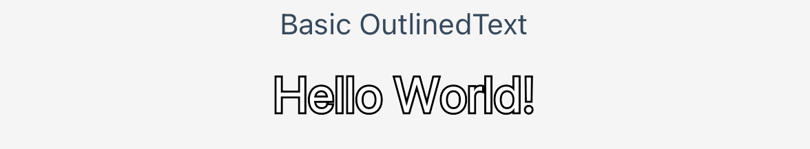
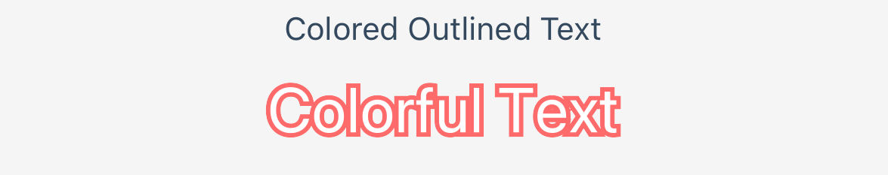
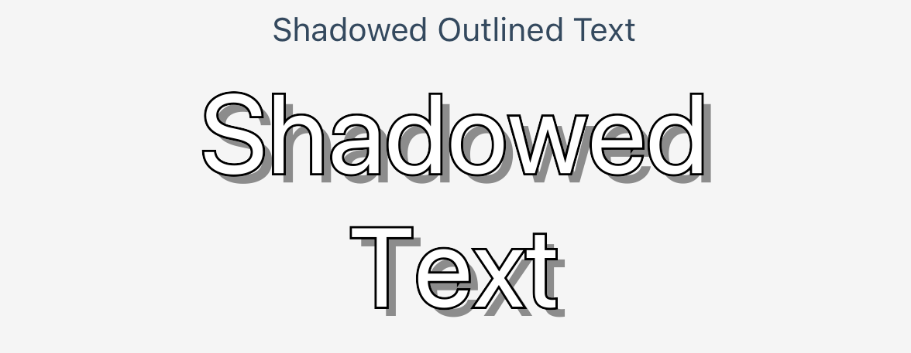

# react-native-outlined-text

[](https://www.npmjs.com/package/@donkasun/react-native-outlined-text)
[](https://www.npmjs.com/package/@donkasun/react-native-outlined-text)


[](https://reactnative.dev/)
[](https://www.typescriptlang.org/)
[](https://github.com/react-native-svg/react-native-svg)

An enhanced, customizable React Native component for creating outlined text with stroke effects and automatic text wrapping.

## Installation

```bash
npm install @donkasun/react-native-outlined-text react-native-svg
# or
yarn add @donkasun/react-native-outlined-text react-native-svg
```

### iOS Setup (if using CocoaPods)

```bash
cd ios && pod install
```

## Quick Start

```tsx
import React from 'react';
import { View } from 'react-native';
import { OutlinedText } from '@donkasun/react-native-outlined-text';

const App = () => {
  return (
    <View style={{ flex: 1, justifyContent: 'center', alignItems: 'center' }}>
      <OutlinedText 
        text="Hello World"
        width={200}
        strokeColor="black"
        strokeWidth={2}
        fillColor="white"
      />
    </View>
  );
};
```

## Examples

### Basic Outlined Text



```tsx
<OutlinedText
  text="Hello World!"
  width={200}
/>
```

### Colored Outlined Text



```tsx
<OutlinedText
  text="Colorful Text"
  fontSize={28}
  strokeWidth={2}
  strokeColor="#ff6b6b"
  fillColor="#FFFFFF"
  width={250}
/>
```

### Shadowed Outlined Text



```tsx
<OutlinedText
  text="Shadowed Text"
  fontSize={48}
  strokeWidth={1}
  strokeColor="#000"
  width={250}
  shadowColor="#8c8c8c"
  shadowOffsetX={4}
  shadowOffsetY={4}
/>
```

## Features

- **Customizable Stroke Effects**: Adjustable stroke width and color
- **Shadow Effects**: Enhanced visual appeal with customizable shadows
- **Automatic Text Wrapping**: Intelligent text wrapping for long content
- **Cross-Platform**: Works seamlessly on iOS and Android
- **TypeScript Support**: Full type safety and IntelliSense
- **Single Component**: `OutlinedText` for all outlined text needs

## API Reference

### OutlinedText Props

| Prop | Type | Default | Description |
|------|------|---------|-------------|
| text | string | - | The text to display |
| width | number | - | Width of the text container |
| height | number | auto | Height of the text container |
| fontSize | number | 26 | Font size of the text |
| strokeColor | string | '#000000' | Color of the text stroke |
| strokeWidth | number | 1 | Width of the text stroke |
| fillColor | string | '#FFFFFF' | Color of the text fill |
| shadowColor | string | '#000000' | Color of the shadow |
| shadowOffsetX | number | 0 | Horizontal shadow offset |
| shadowOffsetY | number | 0 | Vertical shadow offset |
| shadowOpacity | number | 1 | Shadow opacity |
| shadowBlur | number | 0 | Shadow blur radius |
| x | number | width/2 | X position of the text |
| y | number | height/2 | Y position of the text |
| textAnchor | string | 'middle' | Text alignment ('start', 'middle', 'end') |
| fontFamily | string | 'medium' | Font family to use |
| letterSpacing | number | 0 | Letter spacing |
| textTransform | string | 'none' | Text transformation ('none', 'uppercase', 'lowercase', 'capitalize') |
| opacity | number | 1 | Text opacity |

### Advanced Usage

```tsx
import { OutlinedText } from '@donkasun/react-native-outlined-text';

<OutlinedText 
  text="Advanced Outlined Text"
  width={300}
  height={100}
  fontSize={24}
  strokeColor="#FF6B6B"
  strokeWidth={2}
  fillColor="#4ECDC4"
  shadowColor="#8c8c8c"
  shadowOffsetX={3}
  shadowOffsetY={3}
  shadowOpacity={0.8}
  shadowBlur={5}
  x={150}
  y={50}
  textAnchor="middle"
  fontFamily="Arial"
  letterSpacing={1}
  textTransform="uppercase"
  opacity={0.9}
/>
```

## Component Features

### OutlinedText
- Automatic positioning and layout handling
- Easy to use with sensible defaults
- Full control over styling and effects
- Built-in text wrapping for long content

## Frequently Asked Questions

### The text is not displaying correctly

Make sure you have installed `react-native-svg` as it's a required peer dependency.

### How can I center the text?

The text is centered by default. You can use the `textAnchor` prop to change alignment:
- `'start'` - Left align
- `'middle'` - Center align (default)
- `'end'` - Right align

### Can I use custom fonts?

Yes, you can use the `fontFamily` prop. Make sure your fonts are properly linked in your React Native project.

### How do I add shadow effects?

Use the shadow props: `shadowColor`, `shadowOffsetX`, `shadowOffsetY`, `shadowOpacity`, and `shadowBlur`.

## Contributing

Pull requests, feedback, and suggestions are welcome!

## License

MIT © [donkasun](https://github.com/donkasun) 
